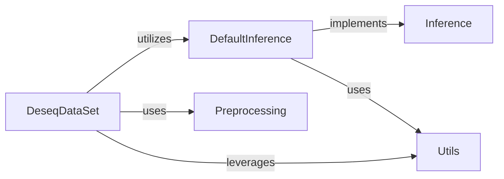

## Details

The Core Data Pipeline component, centered around the pydeseq2.dds.DeseqDataSet class, is the orchestrator of the DESeq2 analysis workflow. It manages data initialization, validation, and coordinates the sequential steps of the analysis, including normalization, dispersion estimation, log-fold change (LFC) calculation, and outlier detection. It serves as the primary interface for users to initiate and run the DESeq2 analysis.

### DeseqDataSet

The central data structure and orchestrator for the DESeq2 analysis. It encapsulates count data, design matrix, and all intermediate results such as size factors, dispersions, and log-fold changes (LFCs). It provides the high-level methods to execute the complete DESeq2 pipeline, including variance stabilizing transformations (VST), dispersion estimation, LFC estimation, and outlier handling. It serves as the primary user interface for initiating and running the DESeq2 analysis.

**Related Classes/Methods**:

- <a href="https://github.com/owkin/PyDESeq2/pydeseq2/dds.py#L31-L1545" target="_blank" rel="noopener noreferrer">`pydeseq2.dds.DeseqDataSet` (31:1545)</a>

### Inference [[Expand]](./Inference.md)

An abstract interface defining the contract for statistical inference algorithms crucial to DESeq2. It outlines the methods for Iteratively Reweighted Least Squares (IRLS) for generalized linear models and maximum likelihood estimation (MLE) for dispersion parameters.

**Related Classes/Methods**:

- <a href="https://github.com/owkin/PyDESeq2/pydeseq2/inference.py#L8-L361" target="_blank" rel="noopener noreferrer">`pydeseq2.inference.Inference` (8:361)</a>

### DefaultInference

The concrete implementation of the core statistical inference algorithms required by DESeq2. This includes the Iteratively Reweighted Least Squares (IRLS) algorithm for fitting generalized linear models, maximum likelihood estimation (MLE) for dispersion parameters, and linear regression for fitting the mean-dispersion trend. It adheres to the `Inference` interface.

**Related Classes/Methods**:

- <a href="https://github.com/owkin/PyDESeq2/pydeseq2/default_inference.py#L13-L263" target="_blank" rel="noopener noreferrer">`pydeseq2.default_inference.DefaultInference` (13:263)</a>

### Preprocessing

Responsible for essential data preprocessing steps within the DESeq2 analysis. This specifically includes DESeq2 normalization (e.g., median-of-ratios method) and variance stabilizing transformations (VST). It provides functions to calculate normalization factors and transform the raw count data, preparing it for accurate statistical modeling.

**Related Classes/Methods**:

- <a href="https://github.com/owkin/PyDESeq2/pydeseq2/preprocessing.py#L0-L0" target="_blank" rel="noopener noreferrer">`pydeseq2.preprocessing` (0:0)</a>

### Utils

A collection of general utility functions used across various parts of the PyDESeq2 library. These functions encompass data validation, common statistical calculations (e.g., `mean_absolute_deviation`, `robust_method_of_moments_disp`, `nb_nll`), and potentially plotting helpers. It provides foundational support for other components.

**Related Classes/Methods**:

- <a href="https://github.com/owkin/PyDESeq2/pydeseq2/utils.py#L0-L0" target="_blank" rel="noopener noreferrer">`pydeseq2.utils` (0:0)</a>

### [FAQ](https://github.com/CodeBoarding/GeneratedOnBoardings/tree/main?tab=readme-ov-file#faq)