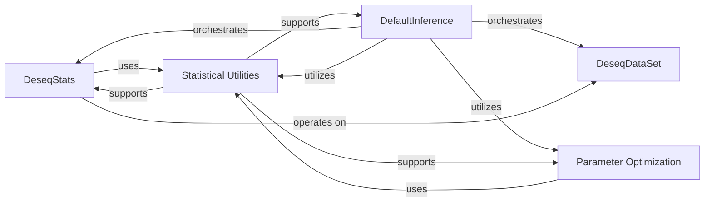

## Details

These components are fundamental to PyDESeq2 because they collectively form the backbone of the differential expression analysis pipeline:

1.  DeseqDataSet: This is the data foundation. Without a structured way to hold and manage the input count data and metadata, no analysis can proceed. It acts as the central data hub for the entire process.

2.  DeseqStats: This component represents the core statistical engine. It encapsulates the specific statistical tests and transformations (like Wald testing and LFC shrinkage) that define the DESeq2 methodology. It's where the biological questions are translated into statistical answers.

3.  DefaultInference: This acts as the workflow orchestrator. It ties together all the disparate steps of the DESeq2 algorithm—from initial data processing to final result generation—ensuring a coherent and automated analysis flow. It's the high-level controller that makes the library usable end-to-end.

4.  Statistical Utilities (pydeseq2.utils): This component is the mathematical bedrock. It provides the essential low-level mathematical and statistical primitives (e.g., negative binomial likelihood, variance calculations) that are repeatedly used across various stages of the DESeq2 algorithm. These utilities ensure the correctness and efficiency of the underlying statistical models. They are fundamental because the accuracy of the DESeq2 results directly depends on these precise calculations.

5.  Parameter Optimization (pydeseq2.grid_search): This component is crucial for model fitting and accuracy. DESeq2 relies on estimating key parameters like dispersion (alpha) and log fold changes (beta). The grid search methods within this component are vital for finding optimal parameter values, which directly impacts the quality and reliability of the differential expression results. It's fundamental for adapting the statistical model to the specific characteristics of the input data.

The Core Utilities & Math component, specifically Statistical Utilities and Parameter Optimization, is fundamental because it provides the granular, precise mathematical and algorithmic tools necessary for the DeseqStats and DefaultInference components to perform their higher-level tasks accurately and efficiently. They are the "how-to" behind the "what" of the DESeq2 analysis.

### DeseqDataSet

This is the foundational data container, holding input count data, sample metadata, and gene metadata. It serves as the primary object for managing all data required for the DESeq2 analysis.

**Related Classes/Methods**: _None_

### DeseqStats

This component is responsible for executing the core statistical analysis, including log fold change shrinkage, Wald testing, and generating results, operating directly on a DeseqDataSet object.

**Related Classes/Methods**: _None_

### DefaultInference

This class orchestrates the entire DESeq2 inference pipeline. It manages the estimation of size factors, dispersions, and log fold changes by coordinating calls to various utility and optimization functions.

**Related Classes/Methods**: _None_

### Statistical Utilities

This component provides a collection of low-level statistical and mathematical helper functions critical for the DESeq2 algorithm. This includes calculations for negative binomial likelihood, variance, mean, and other foundational operations.

**Related Classes/Methods**: _None_

### Parameter Optimization

This component contains specialized functions for parameter optimization, specifically implementing grid search methods for fitting dispersion (alpha) and log fold change (beta) values, often relying on likelihood calculations.

**Related Classes/Methods**: _None_

### [FAQ](https://github.com/CodeBoarding/GeneratedOnBoardings/tree/main?tab=readme-ov-file#faq)