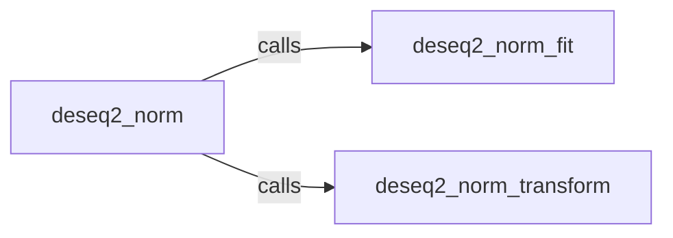

## Details

The `Data Normalization` subsystem in `pydeseq2` is primarily composed of three interconnected functions, rather than a complex class hierarchy. These functions collectively implement the DESeq2 median-of-ratios normalization method.

### deseq2_norm

This function serves as the primary public interface for performing DESeq2 median-of-ratios normalization. It orchestrates the entire normalization workflow by internally calling `deseq2_norm_fit` to compute sample-specific size factors and then `deseq2_norm_transform` to apply these factors, returning the normalized count data. It encapsulates the complete normalization process for user convenience.

**Related Classes/Methods**:

- `deseq2_norm` (1:1)

### deseq2_norm_fit

This function is responsible for the "fitting" phase of the DESeq2 normalization. It takes raw count data as input and calculates the sample-specific size factors. These factors are crucial for adjusting for differences in sequencing depth and other technical variations between samples, forming the basis for comparable downstream analyses.

**Related Classes/Methods**:

- `deseq2_norm_fit` (1:1)

### deseq2_norm_transform

This function performs the "transformation" phase of the DESeq2 normalization. It takes the raw count data and the previously computed size factors (obtained from `deseq2_norm_fit`). It then divides the raw counts by their respective size factors to produce the final normalized count matrix, making the data comparable across samples.

**Related Classes/Methods**:

- `deseq2_norm_transform` (1:1)

### [FAQ](https://github.com/CodeBoarding/GeneratedOnBoardings/tree/main?tab=readme-ov-file#faq)