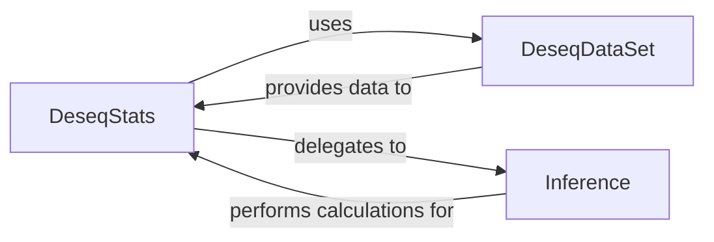

## Details

The Differential Expression Analysis component is primarily orchestrated by the DeseqStats class, which leverages data from DeseqDataSet and statistical capabilities provided by the Inference component (specifically DefaultInference). These three components are fundamental to the subsystem's operation.

### DeseqStats

This is the central orchestrator of the differential expression analysis workflow. It initializes with a DeseqDataSet object and a contrast, then provides methods to run Wald tests, perform LFC shrinkage, apply outlier filtering, and adjust p-values. Its summary() method consolidates these steps to produce the final differential expression results. It delegates core statistical computations to an Inference implementation.

**Related Classes/Methods**:

- <a href="https://github.com/owkin/PyDESeq2/pydeseq2/ds.py#L18-L601" target="_blank" rel="noopener noreferrer">`pydeseq2.ds.DeseqStats` (18:601)</a>

- <a href="https://github.com/owkin/PyDESeq2/pydeseq2/ds.py#L221-L299" target="_blank" rel="noopener noreferrer">`pydeseq2.ds.DeseqStats.summary` (221:299)</a>

### DeseqDataSet

This component serves as the primary data container for the differential expression analysis. It encapsulates raw count data, sample metadata, the design matrix, and stores intermediate results such as size factors, dispersions, and estimated LFCs. DeseqStats relies on a pre-processed DeseqDataSet object to perform its analysis.

**Related Classes/Methods**:

- <a href="https://github.com/owkin/PyDESeq2/pydeseq2/dds.py#L31-L1545" target="_blank" rel="noopener noreferrer">`pydeseq2.dds.DeseqDataSet` (31:1545)</a>

### Inference [[Expand]](./Inference.md)

The Inference component defines the interface for core statistical inference routines, while DefaultInference provides the concrete implementation. This component is responsible for performing the actual Wald tests and LFC shrinkage calculations. DeseqStats delegates these computationally intensive statistical tasks to an instance of this component, allowing for modularity and potential alternative statistical backends.

**Related Classes/Methods**:

- <a href="https://github.com/owkin/PyDESeq2/pydeseq2/inference.py#L8-L361" target="_blank" rel="noopener noreferrer">`pydeseq2.inference.Inference` (8:361)</a>

- <a href="https://github.com/owkin/PyDESeq2/pydeseq2/default_inference.py#L13-L263" target="_blank" rel="noopener noreferrer">`pydeseq2.default_inference.DefaultInference` (13:263)</a>

### [FAQ](https://github.com/CodeBoarding/GeneratedOnBoardings/tree/main?tab=readme-ov-file#faq)