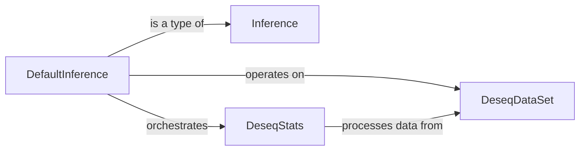

## Details

This component provides the fundamental statistical algorithms required for the DESeq2 analysis, focusing on fitting generalized linear models (GLMs), estimating gene-wise and trend dispersions (alpha MLE), and performing Wald tests. It acts as a foundational statistical engine for the overall DESeq2 pipeline.

### DefaultInference

This is the primary orchestrator of the DESeq2 inference pipeline. It manages the overall flow, including data preparation, invoking statistical modeling, and generating results. It leverages other components like `DeseqStats` to perform the core statistical computations and operates on data provided by `DeseqDataSet`.

**Related Classes/Methods**:

- <a href="https://github.com/owkin/PyDESeq2/pydeseq2/default_inference.py#L13-L263" target="_blank" rel="noopener noreferrer">`pydeseq2.default_inference.DefaultInference` (13:263)</a>

### Inference [[Expand]](./Inference.md)

This abstract base class defines the common interface and foundational structure for various inference methods within `PyDESeq2`. `DefaultInference` inherits from this class, ensuring a consistent and extensible framework for different statistical inference approaches. It provides the blueprint for how statistical inference processes should be structured.

**Related Classes/Methods**:

- <a href="https://github.com/owkin/PyDESeq2/pydeseq2/inference.py#L8-L361" target="_blank" rel="noopener noreferrer">`pydeseq2.inference.Inference` (8:361)</a>

### DeseqStats

This component is central to the statistical modeling and inference. It is responsible for performing the core statistical calculations and hypothesis testing, including estimating dispersion parameters, fitting generalized linear models (GLMs), and conducting differential expression tests (e.g., Wald tests). It operates directly on the data prepared by `DeseqDataSet`.

**Related Classes/Methods**:

- <a href="https://github.com/owkin/PyDESeq2/pydeseq2/ds.py#L18-L601" target="_blank" rel="noopener noreferrer">`pydeseq2.ds.DeseqStats` (18:601)</a>

### DeseqDataSet

This component represents the specialized dataset structure required for DESeq2 analysis. It handles the storage and organization of raw count data, experimental design information, and other relevant metadata. It serves as the central data container that the statistical components, particularly `DeseqStats`, operate on.

**Related Classes/Methods**:

- <a href="https://github.com/owkin/PyDESeq2/pydeseq2/dds.py#L31-L1545" target="_blank" rel="noopener noreferrer">`pydeseq2.dds.DeseqDataSet` (31:1545)</a>

### [FAQ](https://github.com/CodeBoarding/GeneratedOnBoardings/tree/main?tab=readme-ov-file#faq)