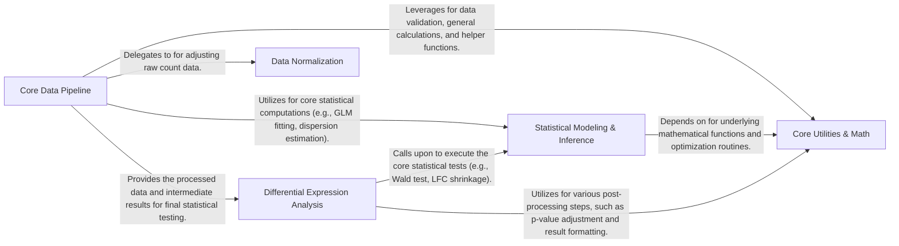

## Details

Final Architecture Analysis for `PyDESeq2`

### Core Data Pipeline [[Expand]](./Core_Data_Pipeline.md)

This component is the central orchestrator of the DESeq2 analysis workflow. It manages the initialization and validation of input data, and coordinates the sequential steps of the analysis, including data normalization, dispersion estimation, log-fold change (LFC) calculation, and outlier detection. It serves as the primary interface for users to initiate and run the DESeq2 analysis.

**Related Classes/Methods**:

- <a href="https://github.com/owkin/PyDESeq2/pydeseq2/dds.py#L31-L1545" target="_blank" rel="noopener noreferrer">`pydeseq2.dds.DeseqDataSet` (31:1545)</a>

### Statistical Modeling & Inference [[Expand]](./Statistical_Modeling_Inference.md)

This component provides the fundamental statistical algorithms required for the DESeq2 analysis. It is responsible for fitting generalized linear models (GLMs), estimating gene-wise and trend dispersions (alpha MLE), and performing Wald tests. It acts as a foundational statistical engine for both the `Core Data Pipeline` and `Differential Expression Analysis` components.

**Related Classes/Methods**:

- <a href="https://github.com/owkin/PyDESeq2/pydeseq2/default_inference.py#L13-L263" target="_blank" rel="noopener noreferrer">`pydeseq2.default_inference.DefaultInference` (13:263)</a>

- <a href="https://github.com/owkin/PyDESeq2/pydeseq2/inference.py#L8-L361" target="_blank" rel="noopener noreferrer">`pydeseq2.inference.Inference` (8:361)</a>

### Differential Expression Analysis [[Expand]](./Differential_Expression_Analysis.md)

This component takes the processed data and statistical estimations from the `Core Data Pipeline` and `Statistical Modeling & Inference` to perform the final differential expression analysis. It handles the execution of Wald tests, applies LFC shrinkage, performs independent filtering, and adjusts p-values to generate a comprehensive summary of differentially expressed genes.

**Related Classes/Methods**:

- <a href="https://github.com/owkin/PyDESeq2/pydeseq2/ds.py#L18-L601" target="_blank" rel="noopener noreferrer">`pydeseq2.ds.DeseqStats` (18:601)</a>

### Data Normalization [[Expand]](./Data_Normalization.md)

This specialized component focuses solely on normalizing raw count data. It implements the DESeq2 median-of-ratios method to account for sequencing depth differences and other technical variations between samples, ensuring that downstream statistical analyses are performed on comparable data.

**Related Classes/Methods**:

- <a href="https://github.com/owkin/PyDESeq2/pydeseq2/preprocessing.py#L30-L55" target="_blank" rel="noopener noreferrer">`pydeseq2.preprocessing.deseq2_norm_fit` (30:55)</a>

- <a href="https://github.com/owkin/PyDESeq2/pydeseq2/preprocessing.py#L58-L101" target="_blank" rel="noopener noreferrer">`pydeseq2.preprocessing.deseq2_norm_transform` (58:101)</a>

- <a href="https://github.com/owkin/PyDESeq2/pydeseq2/preprocessing.py#L4-L27" target="_blank" rel="noopener noreferrer">`pydeseq2.preprocessing.deseq2_norm` (4:27)</a>

### Core Utilities & Math [[Expand]](./Core_Utilities_Math.md)

This comprehensive component provides a wide array of foundational mathematical operations, statistical calculations (e.g., negative binomial likelihood, trimmed mean, variance), data validation routines, and general helper functions. It also includes specialized parameter optimization algorithms, such as grid search methods for fitting dispersion (alpha) and LFC (beta) values. This component serves as a crucial support layer for almost all other parts of the `PyDESeq2` library.

**Related Classes/Methods**:

- <a href="https://github.com/owkin/PyDESeq2/pydeseq2/utils.py#L1-L1" target="_blank" rel="noopener noreferrer">`pydeseq2.utils` (1:1)</a>

- <a href="https://github.com/owkin/PyDESeq2/pydeseq2/grid_search.py#L1-L1" target="_blank" rel="noopener noreferrer">`pydeseq2.grid_search` (1:1)</a>

### [FAQ](https://github.com/CodeBoarding/GeneratedOnBoardings/tree/main?tab=readme-ov-file#faq)